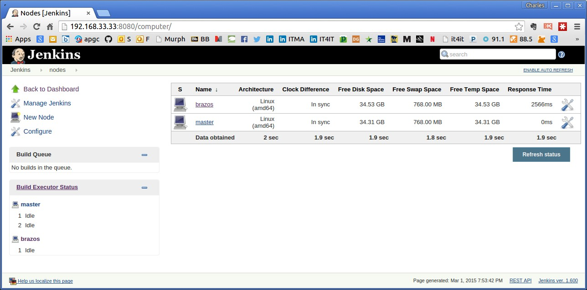

# Installing Calavera

2015-03-01  version 0.1 alpha

## Prerequisites
--
In terms of skills, you need at least a little Vagrant. It is probably the easiest tool in the box here to familiarize yourself with, and there is good material on the web just a Google search away. If you are really, truly unfamiliar with basic computing, virtualization, networking, and the like, this may not be a good project for you to start with.


You need:

* Recent (< 3 yrs old) Pentium or Xeon or similar class AMD chip, multi-core preferable.

* Windows 7+, Mac OS X Mavericks or later, or Ubuntu 14 (note: I have not done extensive version testing; if you have a platform that runs the prequisites listed below it probably will work)

* At least 4 GB of RAM and a computer capable of running 64-bit VMs

* AT LEAST 20 gb of free hard drive space
* Strongly recommend a visualizer so you can monitor VM consumption of disk:
  * [WinDirStat](https://windirstat.info/) for Windows
  * [KDirStat](http://kdirstat.sourceforge.net/) for Unix & Linux
  * [DiskInventoryX](http://www.derlien.com/) for Mac

* You may need to enable [hardware acceleration](http://www.sysprobs.com/disable-enable-virtualization-technology-bios)

The virtual machines use a range of local IP addresses from 192.168.33.29 through 192.168.33.36. Make sure you are not using those for some other project.

You also may wish to review the [Vagrantfile](https://github.com/CharlesTBetz/Calavera/blob/master/Vagrantfile) for port redirect conflicts. A consistent numeric approach has been adopted for redirecting 22, 80 and 8080.

## Installation overview


First, you need to install:

* [VirtualBox](https://www.virtualbox.org/)

* [Vagrant](http://www.vagrantup.com/downloads.html)
  * [Vagrant Berkshelf plugin](https://github.com/berkshelf/vagrant-berkshelf)
  * [Vagrant VBoxGuest plugin](https://github.com/dotless-de/vagrant-vbguest)
* [Chef Development Kit](https://downloads.chef.io/chef-dk/)

And of course you will need git, to download from Github, thus:

    git clone https://github.com/CharlesTBetz/Calavera.git

**Critical configuration tweak**
At this writing you MUST do this:

In a text editor open /opt/chefdk/embedded/apps/berkshelf/lib/berkshelf/berksfile.rb

Find the line starting with EXCLUDED_VCS_FILES_WHEN_VENDORING

change '.git' to '**/.git' in this line:

````
EXCLUDED_VCS_FILES_WHEN_VENDORING = ['.arch-ids', '{arch}', '.bzr', \
 '.bzrignore', '.bzrtags', 'CVS', '.cvsignore', '_darcs', '.git', '.hg', \
  '.hgignore', '.hgrags', 'RCS', 'SCCS', '.svn'].freeze

````

See https://github.com/berkshelf/vagrant-berkshelf/issues/237.

Calavera starts with a script, "startup.sh" or "startup.bat", which takes a standard Opscode image and adds:

* Chef
* Java
* Virtualbox addins
* curl & tree

It then repackages it and destroys the Vagrant machine. The remaining 6 VMs all then use this repackaged base image.

The VMs need to be instantiated in a particular order, with one manual intervention:

1. cerebro (Remote git repo)
1. brazos (Slave build environment)
1. espina (Artifactory)
1. hombros (Jenkins)
1. **manually setup jenkins to use artifactory**
1. manos (Development environment)
1. cara (Production environment)

Any other order will likely result in errors and an unusable cluster. So:

````
vagrant up cerebro
vagrant up brazos
vagrant up espina
vagrant up hombros
````

We have to set up Artifactory in Jenkins because the Jenkins API does not support configuring Artifactory in an automated way, as far as I can see.

You should now be able to see your local Jenkins instance running at:

http://192.168.33.33:8080

And your local Artifactory running at:

http://192.168.33.32:8081

The default Artifactory username/password is admin/password. Completely insecure. DO NOT USE CALAVERA FOR PRODUCTION PURPOSES. IT IS A LAB EXPERIMENT ONLY.

*While we're on the topic of security: The Calavera approach to security is to use the same public/private key pair across all the machines in the cluster. Again, unsuitable for production purposes, but at least you have an ssh-based skeleton and not one based merely on id/password logins.*

Go to your Jenkins instance:


