# Installing Calavera

2015-03-01  version 0.3 alpha

## Prerequisites

As github projects go, this one is intended to be accessible to the person of "general computing literacy." If you are interested in getting started with establishing a Github track record, this might be a good project to start with. There is a diversity of technology here, and some nontrivial tools, but the concepts are all relatively simple. This really is more about systems administration than true software development.  

In terms of skills, you need to be able to install software on your computer, edit text files (NOT using Microsoft Word), and be comfortable with a command prompt. You need some understanding of basic computing, virtualization, networking, and the like. You should have at least a little programming or scripting ability. 

You also need at least a little Vagrant. It is probably the easiest tool in the box here to familiarize yourself with, and there is good material on the web just a Google search away. Spend an hour with the Vagrant tutorial and vagrant up a simple VM or two and you'll be more or less ready for this.

You'll find yourself learning Chef, but since you are starting with a simple, functioning set of interrelated recipes it's not a bad way to start. This project might make a good adjunct if you're running a Chef tutorial. If you want to modify or extend the system, you'll have to pick up some Ruby. There's also a few *.bash scripts. 

You need enough git to clone this repository to your machine. That's just one command, shown below. But it would be nice if you could help improve the project by forking your own repo, making enhancements, and sending up pull requests. They will be reviewed and acted upon.

You need:

* Internet connectivity for all the install steps (the cluster will run without Internet once it is up)

* Recent (< 3 yrs old) Pentium or Xeon or similar class AMD chip, multi-core preferable.

* Windows 7+, Mac OS X Mavericks or later, or Ubuntu 14 (note: I have not done extensive version testing; if you have a platform that runs the prequisites listed below it probably will work)

* At least 8 GB of RAM (16 or more recommended; if you have 4 you can try --  shut everything else off) and a computer capable of running 64-bit VMs

* AT LEAST 20 gb of free hard drive space
* Strongly recommend a visualizer so you can monitor VM consumption of disk:
  * [WinDirStat](https://windirstat.info/) for Windows
  * [KDirStat](http://kdirstat.sourceforge.net/) for Unix & Linux
  * [DiskInventoryX](http://www.derlien.com/) for Mac

* You may need to enable [hardware acceleration](http://www.sysprobs.com/disable-enable-virtualization-technology-bios)

The virtual machines use a range of local IP addresses from 192.168.33.29 through 192.168.33.36. Make sure you are not using those for some other project.

You also may wish to review the [Vagrantfile](https://github.com/CharlesTBetz/Calavera/blob/master/Vagrantfile) for port redirect conflicts. A consistent numeric approach has been adopted for redirecting 22, 80 and 8080. If you don't know what this is about that's fine for now.

## Installation precursors and overview


First, you need to install:

* [VirtualBox](https://www.virtualbox.org/)

* [Vagrant](http://www.vagrantup.com/downloads.html)
  * [Vagrant Berkshelf plugin](https://github.com/berkshelf/vagrant-berkshelf)
  * [Vagrant VBoxGuest plugin](https://github.com/dotless-de/vagrant-vbguest)
* [Chef Development Kit](https://downloads.chef.io/chef-dk/) version 0.4 or later


And of course you will need [git](http://git-scm.com/book/en/v2/Getting-Started-Installing-Git), to download from Github.

**Critical pre-install configuration tweak**
At this writing you MUST do this AFTER you install the ChefDK:

In a text editor open /opt/chefdk/embedded/apps/berkshelf/lib/berkshelf/berksfile.rb

Find the line starting with EXCLUDED_VCS_FILES_WHEN_VENDORING

change '.git' to '**/.git' in this line:

````
EXCLUDED_VCS_FILES_WHEN_VENDORING = ['.arch-ids', '{arch}', '.bzr', \
 '.bzrignore', '.bzrtags', 'CVS', '.cvsignore', '_darcs', '.git', '.hg', \
  '.hgignore', '.hgrags', 'RCS', 'SCCS', '.svn'].freeze

````

See https://github.com/berkshelf/vagrant-berkshelf/issues/237.

Calavera starts with a script, "startup.sh" or "startup.bat", which takes a standard Opscode image and adds:

* Chef
* Java
* Virtualbox addins
* curl & tree

It then repackages it and destroys the Vagrant machine. The remaining 6 VMs all then use this repackaged base image.

The VMs need to be instantiated in a particular order, with one manual intervention:

1. cerebro (Remote git repo)
1. brazos (Slave build environment)
1. espina (Artifactory)
1. hombros (Jenkins)
1. **manually setup jenkins to use artifactory**
1. manos (Development environment)
1. cara (Production environment)

Any other order will likely result in errors and a "cluster" in another sense of that word.

## Issues

I  am actively monitoring [Github Issues for this project](https://github.com/CharlesTBetz/Calavera/issues). If you run into something, please post there. 

## Installation step by step

Figure out a suitable location to download the repository from Github. It is not large, but I recommend that you not "nest" it too deeply (Windows is especially annoying this way) and that you avoid having spaces in the pathnames (e.g. "My Documents"). Creating a C:\home\myname directory would be a good location example. Open a command window there and type:

    git clone https://github.com/CharlesTBetz/Calavera.git


CD to the new Calavera directory, and run the following, one at a time. They will generate LOTS of console output, but hopefully no errors. This may take you around 20 minutes. It will appear to hang in places (Java related stuff in particular); give it at least 15 minutes before killing anything.

Disclaimner: this is still very early stage work. Many failure modes.

````
./startup.sh  (or startup.bat on windows)
vagrant up cerebro
vagrant up brazos
vagrant up espina
vagrant up hombros
````

All done with those first 5? Good.

We now have to set up Artifactory in Jenkins using the Jenkins GUI because the Jenkins API does not support configuring Artifactory in an automated way, as far as I can see. (Kudos for someone who can automate it, but I'd rather not see a lot of curl-type hacking.)

You should now be able to see your local Jenkins instance running at:

http://192.168.33.33:8080

And your local Artifactory running at:

http://192.168.33.32:8081

The default Artifactory username/password is admin/password. Completely insecure. DO NOT USE CALAVERA FOR PRODUCTION PURPOSES. IT IS A LAB EXPERIMENT ONLY.

*While we're on the topic of security: The Calavera approach to security is to use the same public/private key pair across all the machines in the cluster. Again, unsuitable for production purposes, but at least you have an ssh-based skeleton and not one based merely on id/password logins.*

Go to your Jenkins instance:

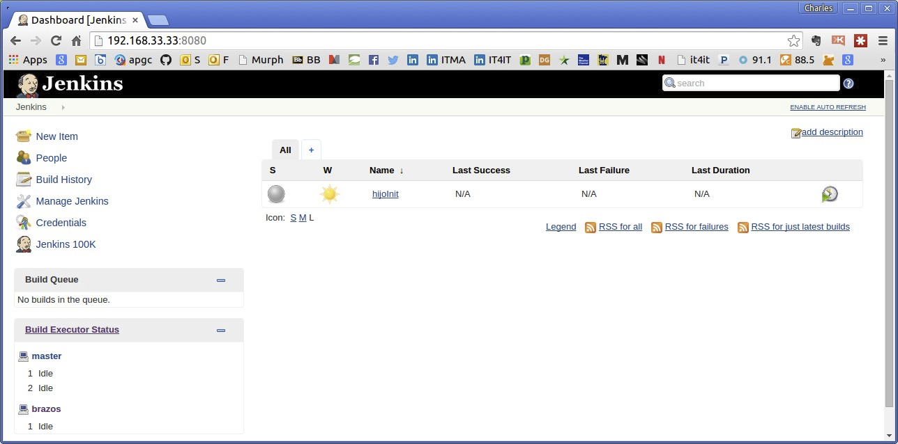

Choose "Manage Jenkins":

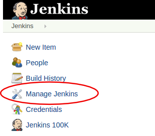

Choose "Configure System":

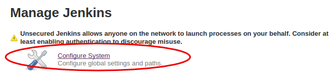


Scroll about halfway down to the "Artifactory" section and press the Add button:

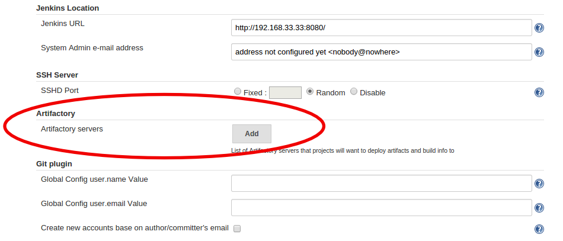

As shown, enter

http://192.168.33.32:8081/artifactory/

and the default username/password of "admin/password."

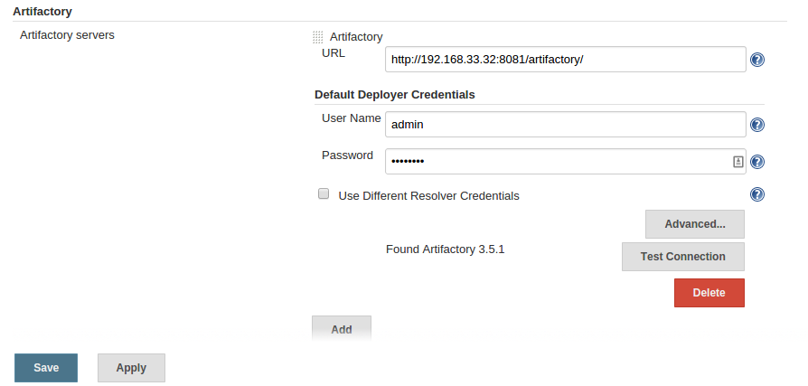

Press Test Connection. The message "Found Artifactory X.X.X" should appear. If not, double check that Espina is running and you can access the Artifactory repository URL through a browser.

If all is well, click Save. You will be taken back to the main dashboard.

Click hijoInit.

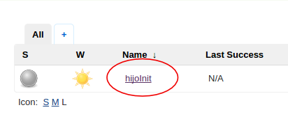

Click Configure.

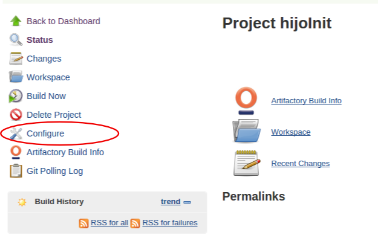

Find the Artifactory Configuration section. Click Refresh Repositories.

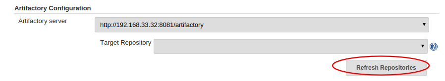

Notice that "ext-release-local" appears along with the message "Items refreshed successfully":

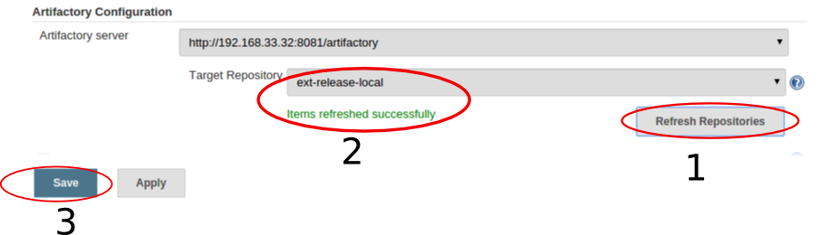

Click Save.

### Bringing up manos

Now, the acid test: bringing up manos. The user guide (to be written) will go into details on this, but let's just say there are a lot of ways Manos can fail. The precursor machines must have all come up without error.

    vagrant up manos

If the console output seems to have gone without a hitch, go first to Jenkins. As part of its provisioning, manos does an initial ant build & test, local Tomcat deployment, and git commit and remote push which should result in a Jenkins build and an Artifactory check in.

To check all this out, first go to:

http://192.168.33.34:8080/MainServlet

This is the developer instance of Tomcat. You should see the Calavera message there.

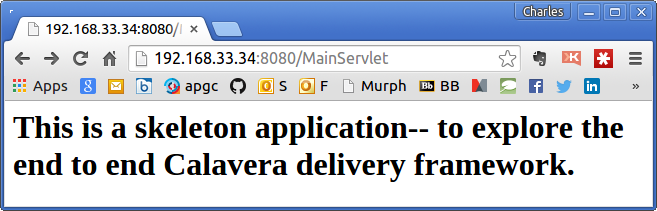

Then, go to Jenkins. You should see a first successful build:
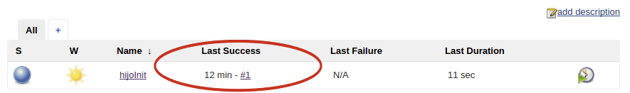

(Feel free to click on the "#1" and poke around.)

Finally, if you go to:

http://192.168.33.32:8081/artifactory/webapp/home.html

you will see that Artifactory is now "happily serving 2 artifacts." Hooray! Click on the "Artifacts" tab:

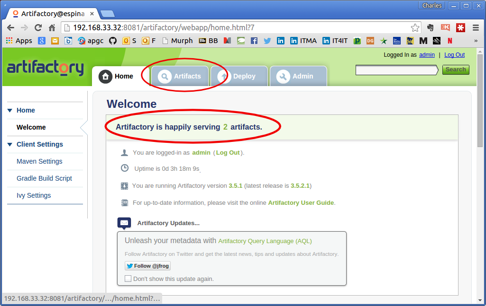

and if you expand the tree node that says "ext-release-local" (remember configuring that above?) you will see that the Calavera release artifacts are deployed and ready for production!

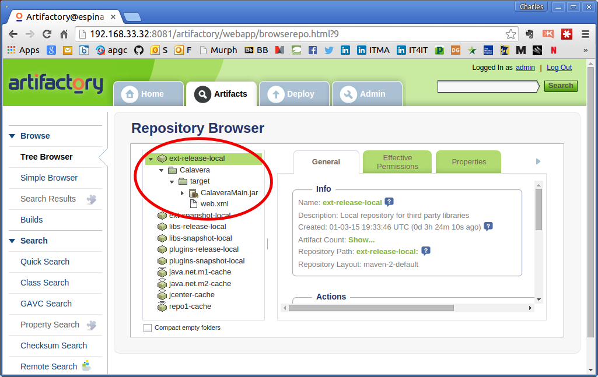

[author's note: take a pre-manos shot of hombros espina for contrast next time it is built]

### Deploying to cara

Bringing up cara is a little anticlimactic.

    vagrant up cara

Assuming everything previously went well, chef will pull the .jar and .xml file from Artifactory on espina and deploy and restart Tomcat. You can go to:

http://192.168.33.35:8080/MainServlet

and should see:

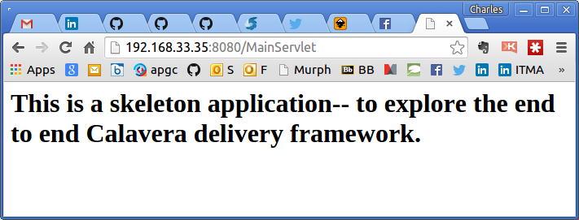

Hooray! What next?

A user guide is in process to describe the various aspects of Calavera and how to actually use and extend the pipeline. Stay tuned. Or better yet, help!
